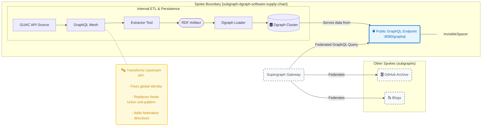

# Subgraph: Dgraph Software Supply Chain

> ## 🚧 **Architectural Blueprints Ahead! 🚀**
>
> Welcome! This repository contains a **work-in-progress** implementation. While the code is still evolving, the architectural and design documentation here represents our north star for building a high-performance, federated graph for software supply chain security. We're excited to have you here and welcome you to explore the designs and join us in the discussions on CNCF Slack in [#initiative-supply-chain-security-insights](https://cloud-native.slack.com/archives/C09A8VBEUNM).

## 1. Overview

This repository contains the source code, operational configuration, and detailed architectural documentation for the `subgraph-dgraph-software-supply-chain`. This service is a foundational ["Spoke"](https://github.com/graphtastic/platform/blob/main/docs/design/tome--graphtastic-platform-docker-compose.md#31-the-hub-and-spoke-model) within the [Graphtastic Platform](https://github.com/graphtastic/platform/blob/main/README.md#the-graphtastic-platform), designed to provide a high-performance, federated GraphQL API for software supply chain security data.

### 1.1. Strategic Goals

This subgraph serves two primary, strategic purposes:

1. **CNCF Demonstrator:** To act as a reference implementation and standalone demonstrator for the [CNCF Software Supply Chain Insights initiative](https://github.com/cncf/toc/issues/1709).
2. **Federated Spoke:** To function as a fully compliant, federated Spoke within the Graphtastic supergraph, aggregating and exposing security data from multiple sources.

### 1.2. Core Technology

Our architecture is built on a foundation of powerful, cloud-native technologies:

* **Data Source:** [GUAC (Graph for Understanding Artifact Composition)](https://guac.sh/) instances, which generate rich software supply chain metadata.
* **Persistence Layer:** [Dgraph](https://dgraph.io/), a distributed, native GraphQL graph database chosen for its horizontal scalability and high-performance query capabilities.
* **API Layer:** A GraphQL API designed from the großund up to be compliant with the [Apollo Federation](https://www.apollographql.com/docs/federation/) specification.
* **Development Environment:** A modular, multi-stack [Docker Compose](https://docs.docker.com/compose/) environment, orchestrated with `make` for a seamless and reproducible developer experience.

## 2. Architecture

This subgraph follows a decoupled, schema-driven ETL (Extract, Transform, Load) architecture to ingest data. The entire ingestion pipeline is an internal implementation detail, encapsulated within the Spoke's boundary. This "Spoke as a Black Box" approach is a core principle of the Graphtastic Platform, ensuring that the Spoke's public contract is its GraphQL API and nothing more.



### 2.1. Data Ingestion Flow

1. **Extract & Transform:** A high-fidelity extractor tool queries one or more source GUAC GraphQL APIs. It uses GUAC's own pre-defined query files to ensure robustness. The extracted data is transformed into compressed RDF N-Quad files, a format optimized for Dgraph's loaders.
2. **Load:** The generated RDF files are loaded into Dgraph using its high-performance native tooling (`dgraph bulk` for initial population and `dgraph live` for incremental updates).
3. **Deduplication:** The Dgraph schema is programmatically augmented with `@id` directives on natural business keys. This pushes the responsibility for data deduplication down into the database layer, enabling idempotent upserts and ensuring that data from multiple GUAC sources is correctly merged into a single, canonical entity.

For a complete breakdown of this architecture, please see the core implementation design:

* [**`./design--guac-to-dgraph.md`**](./design--guac-to-dgraph.md)

## 3. Local Development

This project uses a modular, multi-stack Docker Compose architecture orchestrated by a central `Makefile` to provide a simple and consistent developer experience.

### 3.1. Prerequisites

* Docker Engine and the Docker Compose CLI plugin
* `make`

### 3.2. Getting Started

1. **Clone the repository:**

    ```bash
    git clone <this-repo-url>
    cd <this-repo-directory>
    ```

2. **Configure the environment:**
    Copy the example environment file and customize it if necessary.

    ```bash
    cp .env.example .env
    ```

3. **Launch the full stack:**
    This single command will create the shared Docker networks and volumes, then bring up the Dgraph cluster, the API service, and any other required components in the correct order.

    ```bash
    make up
    ```

4. **Verify the services:**
    * **Dgraph Ratel UI:** [http://localhost:8000](http://localhost:8000)
    * **Dgraph GraphQL Endpoint:** [http://localhost:8080/graphql](http://localhost:8080/graphql)

5. **Populate with data:**
    To run the ETL pipeline and seed the Dgraph instance with data from a source GUAC API, run:

    ```bash
    make seed
    ```

6. **Tear down the environment:**
    To stop all containers and remove the Docker network, run:

    ```bash
    make down
    ```

7. **Perform a full cleanup:**
    To stop containers and **permanently delete all persistent data**, run:

    ```bash
    make clean
    ```

## 4. Project Documentation & Design Philosophy

This repository is not just a collection of code; it is a curated set of architectural patterns and design documents that form our engineering standard. The following documents are essential reading for any contributor to understand not just the "how," but the "why" behind our approach.

### 4.1. Platform Architecture & Philosophy

To understand how this subgraph fits into the larger ecosystem, we highly recommend reading the core Graphtastic Platform documentation.

| Document                                                                                               | Description                                                                                                                                                                                                                                                                                             |
| :----------------------------------------------------------------------------------------------------- | :------------------------------------------------------------------------------------------------------------------------------------------------------------------------------------------------------------------------------------------------------------------------------------------------------ |
| [Graphtastic Platform README](https://github.com/graphtastic/platform/blob/main/README.md)             | The main entry point for the entire Graphtastic Platform. It outlines the vision of a unified supergraph composed of independent **Spokes**, the central role of the `Makefile` **developer control plane**, and our documentation philosophy centered on **Tomes**. This is the best place to start! |
| [Tome: Graphtastic Platform Docker Compose](https://github.com/graphtastic/platform/blob/main/docs/design/tome--graphtastic-platform-docker-compose.md) | The formal design "Tome" that details the architectural principles and conventions for our multi-stack Docker Compose environments. It explains the "why" behind the modular setup detailed in our practical guides, ensuring every Spoke provides a consistent and seamless developer experience.         |

### 4.2. Core Architectural Designs

| Document                                           | Description                                                                                                                                                                                            |
| :------------------------------------------------- | :----------------------------------------------------------------------------------------------------------------------------------------------------------------------------------------------------- |
| [`design--guac-to-dgraph.md`](./design--guac-to-dgraph.md) | The definitive implementation plan for this subgraph. It details the schema analysis, the two-phase ETL pipeline, data deduplication strategies, and the schema augmentation process for Dgraph. |

### 4.3. Development and Operations Guides

| Document                                                              | Description                                                                                                                                                                                     |
| :-------------------------------------------------------------------- | :---------------------------------------------------------------------------------------------------------------------------------------------------------------------------------------------- |
| [`on--dgraph-docker-compose.md`](./on--dgraph-docker-compose.md)                 | A comprehensive guide to our production-ready Dgraph cluster setup using Docker Compose, detailing the roles of Zero, Alpha, and Ratel, and our strategy for persistent storage.                |
| [`on--running-multiple-docker-compose-stacks.md`](./on--running-multiple-docker-compose-stacks.md) | The architectural blueprint for our modular local development environment. It explains why we avoid monolithic Compose files and how we implement shared networking and storage across stacks. |

### 4.4. GraphQL Primers

| Document                                                                | Description                                                                                                                                                                                                                               |
| :---------------------------------------------------------------------- | :---------------------------------------------------------------------------------------------------------------------------------------------------------------------------------------------------------------------------------------- |
| [`on--object-identification-in-graphql.md`](./on--object-identification-in-graphql.md) | An in-depth report on the **Global Object Identification (GOI)** specification. This is essential reading to understand how we enable client-side caching, data refetching, and federation via unique `id` fields. |
| [`on--node-union-antipattern.md`](./on--node-union-antipattern.md)                 | A critical analysis of why our schema consistently prefers **`interface`** types over `union` types for modeling polymorphic collections of entities, a decision crucial for schema evolvability and maintainability.        |

## 5. Contributing

Contributions are welcome! Please see our contributing guidelines for more information on how to get involved.

## Licensing

This project is dual-licensed to enable broad code adoption while ensuring our documentation and knowledge base remain open for the community. Project copyright and contributor attribution are managed in our [`NOTICE`](./NOTICE) and [`CONTRIBUTORS.md`](./CONTRIBUTORS.md) files.

* **Code is licensed under [Apache 2.0](https.www.apache.org/licenses/LICENSE-2.0).** This permissive license allows free use in both open-source and commercial products. The full license text is in [`LICENSE.code`](./LICENSE.code).

* **Documentation is licensed under [CC BY-SA 4.0](https://creativecommons.org/licenses/by-sa/4.0/).** This requires **Attribution** for our contributors and that derivative works are shared back under the same **ShareAlike** terms. The full license text is in [`LICENSE.docs`](./LICENSE.docs).
