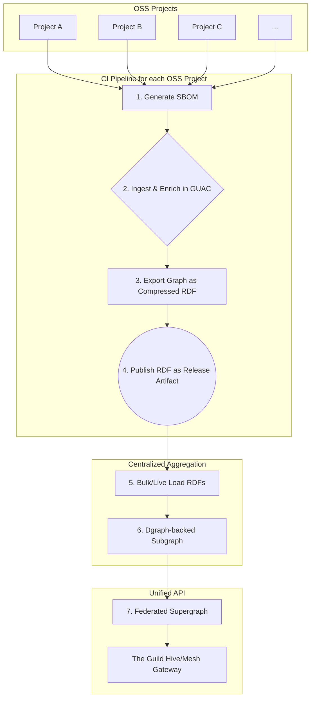
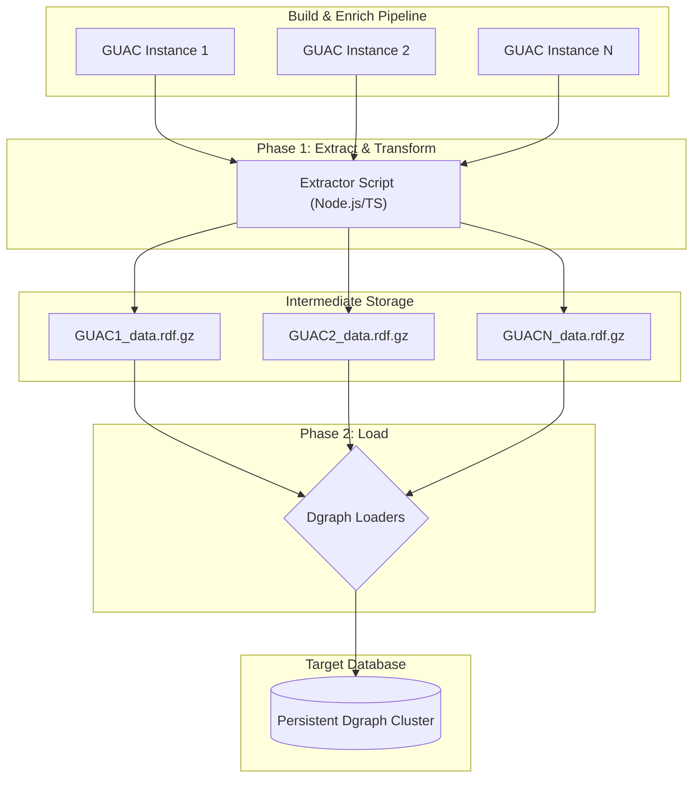
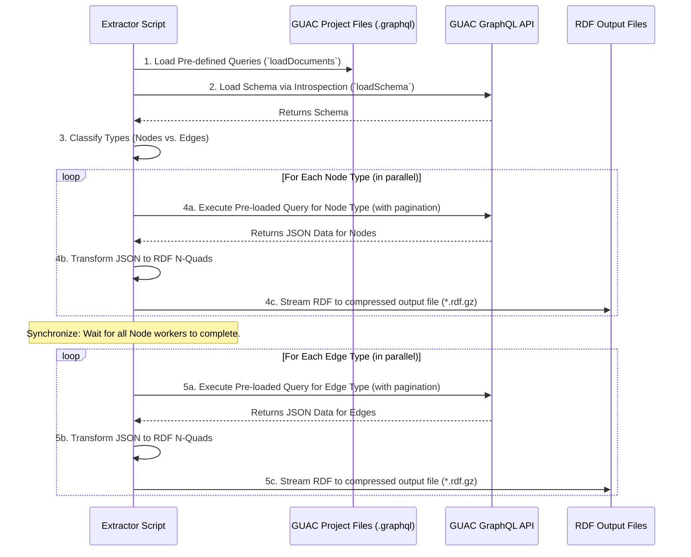
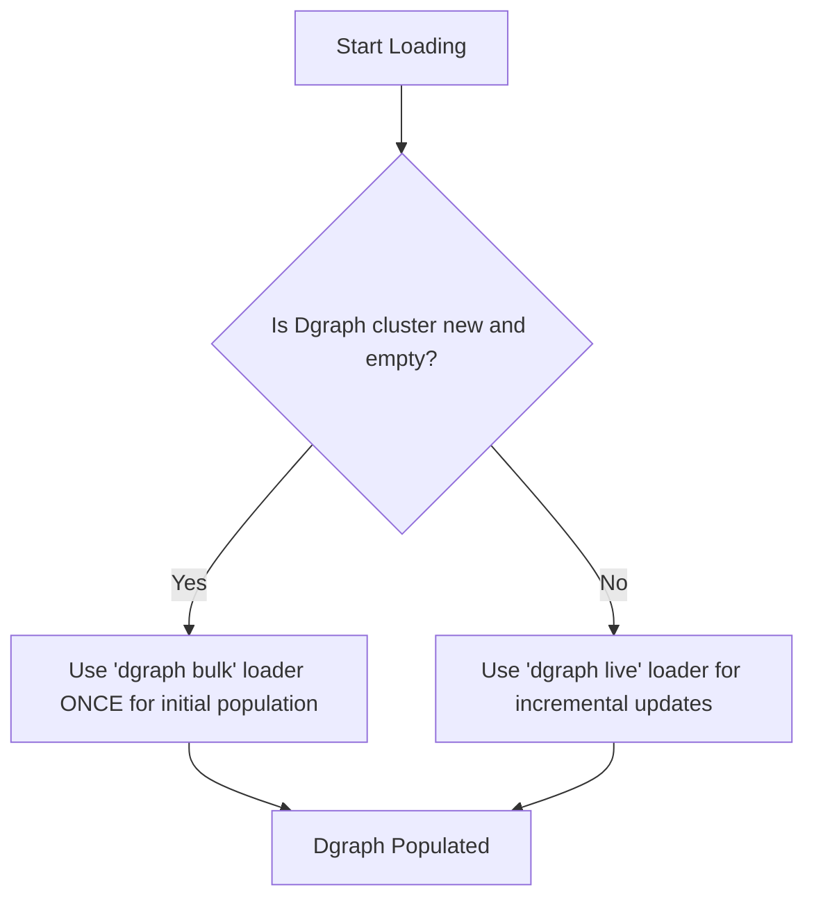

### Table of Contents

*   **1. Executive Summary & Strategic Goals**
    *   1.1. The Business Objective: A Unified, Persistent Software Supply Chain Graph
    *   1.2. Core Architectural Principles: Decoupling, Fidelity, and Performance
    *   1.3. Summary of Key Architectural Decisions
*   **2. Foundational Concepts: GraphQL as a Data Lingua Franca**
    *   2.1. The Impedance Mismatch: Understanding GraphQL's Design for Bulk Data
    *   2.2. The Macroscopic "N+1 Query Problem" and Its Avoidance
    *   2.3. On Unique Identifiers: Specification vs. Convention
        *   2.3.1. The Global Object Identification (GOI) Pattern
        *   2.3.2. Strategies for Synthesizing Globally Unique IDs
*   **3. The GUAC GraphQL Schema: An In-Depth Analysis**
    *   3.1. The GUAC Ontology: Deconstructing Nodes (Nouns) and Edges (Verbs)
    *   3.2. Classification of GUAC Types for Staged Migration
    *   3.3. Critical Finding: The Unsuitability of GUAC's `id` for Data Aggregation
    *   3.4. Identifying Natural Keys for Canonical Identification and Deduplication
*   **4. Target Architecture: The Dgraph GraphQL Endpoint**
    *   4.1. Automated Provisioning via Schema Definition Language (SDL)
    *   4.2. Schema Augmentation: Transforming the GUAC Schema for Dgraph
        *   4.2.1. Enabling Deduplication with the `@id` Directive
        *   4.2.2. Enabling High-Performance Queries with the `@search` Directive
    *   4.3. The Augmented GUAC Schema for Dgraph
*   **5. The Migration Pipeline: A Detailed Architectural Blueprint**
    *   5.1. High-Level Architecture: A Decoupled, Two-Phase ETL Process
    *   5.2. Phase 1: Data Extraction & Transformation (GUAC API → RDF Files)
        *   5.2.1. Core Engine: A Parallelized, Two-Stage Approach
        *   5.2.2. Query Strategy: High-Fidelity Pre-defined Queries
        *   5.2.3. Extractor Process Flow
    *   5.3. Phase 2: Data Loading (RDF Files → Dgraph)
        *   5.3.1. Initial Population: Dgraph Bulk Loader
        *   5.3.2. Incremental Updates: Dgraph Live Loader
        *   5.3.3. The Deduplication and Upsert Mechanism in Practice
*   **6. Implementation & Operational Guide**
    *   6.1. Recommended Technology Stack: Node.js & The Guild's Tooling
    *   6.2. Advanced Engineering for Performance and Resilience
        *   6.2.1. Resilient Extraction with Cursor-Based Pagination
        *   6.2.2. Maximizing Throughput with Buffering
        *   6.2.3. Reliability Patterns: Retries, Backoff, and Rate Limiting
    *   6.3. Configuration and Operationalization
*   **7. Post-Migration Validation & Integrity Audits**
    *   7.1. A Framework for Verifying Migration Success
    *   7.2. Validation Queries: Completeness, Integrity, and Deduplication
*   **8. Conclusion & Strategic Evolution**
    *   8.1. Summary of Architectural Recommendations
    *   8.2. Future Enhancement: Incremental (Delta) Migrations
    *   8.3. Future Enhancement: Evolving towards GraphQL Federation
*   **Appendix**
    *   A. The Guild's Ecosystem: Rationale for the Technology Stack
    *   B. List of Works Cited / Additional Resources

---

### 1. Executive Summary & Strategic Goals

This document outlines the architectural design for a high-performance, schema-driven Extract, Transform, Load (ETL) pipeline. The primary objective is to reliably and efficiently migrate large-scale graph datasets from one or more GUAC (Graph for Understanding Artifact Composition) instances into a single, persistent, and query-optimized Dgraph instance.

The following diagram illustrates the end-to-end vision, from individual open source projects generating supply chain metadata to the aggregation of that data into a unified, federated graph.



While the immediate demonstrator of this architecture is the GUAC-to-Dgraph migration, the underlying patterns and tooling are designed to be general-purpose, establishing a framework for leveraging GraphQL as a *lingua franca* for data interchange between disparate graph systems.

#### 1.1. The Business Objective: A Unified, Persistent Software Supply Chain Graph

GUAC instances generate invaluable software supply chain metadata. While GUAC can be used in ephemeral CI/CD build cycles, it is also suited for larger, centralized deployments. In either scenario, the default persistence layers may not be designed for the massive scale and complex analytical queries required when aggregating data across an entire organization.

The chosen platform for this persistent graph is Dgraph, a horizontally scalable, distributed GraphQL database. It is designed from the ground up for high-performance graph queries and provides essential features like ACID transactions, consistent replication, and linearizable reads. Dgraph is open source and licensed under the Apache-2.0 license, making it a suitable choice for this project.

The goal is to create a centralized, persistent Dgraph instance that serves as the canonical, aggregated source of truth for all software supply chain information. This unified graph will enable advanced security analysis, dependency tracking, and vulnerability impact assessment at a scale not possible with isolated GUAC instances.

#### 1.2. Core Architectural Principles: Decoupling, Fidelity, and Performance

The design is founded on three core principles to ensure a robust and scalable solution:

1. **Decoupling & Resilience**: The pipeline is separated into two distinct phases: extraction and loading. This modularity, connected via an intermediate file-based representation, ensures that a failure in one stage (e.g., a network issue during loading) does not require a costly restart of the entire process.

    This decoupling also facilitates a powerful open-source collaboration model. Individual open-source projects can run a CI job (e.g., a GitHub Action) that, after generating build artifacts like SBOMs, runs a local GUAC instance. This instance builds and enriches the graph for that specific project. The CI job then exports the complete graph as a compressed RDF file, which is published as a standard release artifact alongside binaries and source code. The centralized Dgraph instance can then fetch these RDF artifacts from many different projects and ingest them in a single bulk operation using the Dgraph Bulk Loader. For more continuous updates, the Live Loader will also be supported.
2. **High Fidelity**: The extraction process is driven by the GUAC project's own pre-existing `.graphql` query files. This guarantees that data is fetched exactly as the source application's developers intended, improving reliability and significantly reducing long-term maintenance overhead.
3. **Maximum Performance**: The architecture uses the most efficient tool for each job. For the massive initial data population, it leverages Dgraph's offline **Bulk Loader**. For all subsequent incremental updates, it uses the online **Live Loader**, ensuring maximum ingestion throughput in all scenarios.

#### 1.3. Summary of Key Architectural Decisions

* **Core Architecture**: A decoupled, two-phase ETL pipeline where data is first extracted from the GUAC GraphQL API to compressed RDF files, and then loaded into Dgraph from those files.
* **Technology Stack**: A Node.js and TypeScript environment to natively leverage the powerful, low-level tooling from The Guild's GraphQL ecosystem.
* **Query Strategy**: A high-fidelity approach using GUAC's own pre-defined `.graphql` files as the primary source for extraction queries, with optional support for dynamic query generation.
* **Data Deduplication**: A schema-driven "upsert" strategy, enabled by programmatically augmenting the source schema with Dgraph's `@id` directive on natural business keys. This pushes the complexity of deduplication down into the database layer, which is optimized for the task.

### 2. Foundational Concepts: GraphQL as a Data Lingua Franca

To architect a successful migration pipeline, one must first understand the nuances of using GraphQL—a protocol designed for selective data retrieval—for bulk data export.

#### 2.1. The Impedance Mismatch: Understanding GraphQL's Design for Bulk Data

GraphQL's primary strength is empowering clients to request precisely the data they need, preventing the over-fetching common in traditional REST APIs. This is exceptionally efficient for user interfaces and client-side applications. However, a bulk data migration is the conceptual opposite: the goal is to retrieve *all* data for one or more types. This creates a fundamental "impedance mismatch" where a protocol optimized for fetching fragments is tasked with exporting an entire graph. This necessitates a purpose-built architecture that respects the protocol's constraints while achieving the goal of complete data extraction.

#### 2.2. The Macroscopic "N+1 Query Problem" and Its Avoidance

A naive attempt to export a graph by recursively traversing its relationships (e.g., fetch packages, then for each package, fetch its dependencies) results in the "N+1 query problem" at a massive scale. This leads to an exponential explosion of network requests that would cripple the source API.

The chosen architecture avoids this entirely by adopting a systematic, type-by-type extraction process. It fetches all instances of a given type (e.g., all `Artifact` nodes) in a single, efficient, paginated operation. Different types can be exracted and processed in parallel or serially depending on the GUAC source system's capacity.

#### 2.3. On Unique Identifiers: Specification vs. Convention

A critical aspect of data aggregation and caching is object identity. The GraphQL specification is intentionally unopinionated on this, providing an `ID` scalar type but not mandating its use.

##### 2.3.1. The Global Object Identification (GOI) Pattern

The widespread assumption that every object must have a globally unique `id` stems from a powerful community convention known as the Global Object Identification (GOI) Specification. This pattern, popularized by frameworks like Relay, establishes a contract that enables robust client-side caching, standardized data refetching, and advanced architectures like federation. It guarantees that an `id` is not just unique to its type, but unique across the entire schema.

##### 2.3.2. Strategies for Synthesizing Globally Unique IDs

When a source system does not provide globally unique and stable identifiers (as is the case with GUAC), a new canonical identifier must be synthesized. The most robust pattern is to combine the object's type name with its natural, business-logic key(s) and encode the result. For example, an `Artifact` with a SHA256 digest of `f0e0...` could be synthesized into an opaque ID like `base64('Artifact:f0e0...')`. This synthesized ID becomes the true global identifier for the entity in the target system.

### 3. The GUAC GraphQL Schema: An In-Depth Analysis

A deep understanding of the GUAC schema's structure and semantics is essential to inform the migration strategy, particularly the classification of types and the identification of natural keys for deduplication. For a complete reference, please consult the official [GUAC GraphQL Documentation](https://docs.guac.sh/graphql/) and the [GUAC Ontology Documentation](https://docs.guac.sh/guac-ontology/), which are the canonical sources for this information. This design document will summarize the key aspects relevant to the migration pipeline.

The following diagrams from the GUAC documentation are particularly useful for understanding the core concepts.

*Figure 1: High-level schematic of the GUAC ontology, illustrating the relationships between the core "noun" and "verb" components.*

*Source: GUAC Ontology Documentation (https://docs.guac.sh/guac-ontology/)*

*Figure 2: A more detailed entity-relationship diagram of the GUAC graph.*

*Source: GUAC GraphQL Documentation (https://docs.guac.sh/graphql/)*

#### 3.1. The GUAC Ontology: Deconstructing Nodes (Nouns) and Edges (Verbs)

The GUAC documentation frames its ontology in terms of "nouns" (the core, independent entities) and "verbs" (the evidence-based relationships that connect them). This model aligns perfectly with the architectural need for a two-stage migration that preserves relational integrity. The "nouns" must be ingested in Stage 1 before the "verbs" that connect them can be created in Stage 2.

#### 3.2. Classification of GUAC Types for Staged Migration

To operationalize this concept, each GUAC type is classified for processing in either Stage 1 or Stage 2.

**Stage 1: Node Ingestion (The "Nouns")**

| GUAC Type | Description | Natural Key(s) for Deduplication |
| :---- | :---- | :---- |
| **Package** | A software package, represented as a pURL trie. | type, namespace, name, version, qualifiers, subpath (The full pURL components) |
| **Source** | A source code repository, represented as a trie. | type, namespace, name, tag/commit |
| **Artifact** | A specific file or binary. | algorithm, digest |
| **Builder** | An entity that builds an artifact. | uri |
| **Vulnerability** | A vulnerability, represented as a trie. | type, vulnerabilityID. (Replaces separate OSV/CVE/GHSA types). |
| **License** | A software license. | name (e.g., SPDX ID or LicenseRef-\<guid\>) |

**Stage 2: Edge Ingestion (The "Verbs")**

| GUAC Type | Description | Connects |
| :---- | :---- | :---- |
| **CertifyGood/Bad** | An assertion of trust about a subject. | Package/Source/Artifact |
| **CertifyVuln** | Links a package to a known vulnerability. | Package → Vulnerability |
| **CertifyVEXStatement** | A VEX statement about a vulnerability's impact. | Package/Artifact → Vulnerability |
| **IsDependency** | Represents a dependency between two packages. | Package → Package |
| **HasSourceAt** | Links a package to its source repository. | Package → Source |
| **HasSLSA** | SLSA attestation for an artifact. | Artifact → Builder, Artifact |
| **IsOccurrence** | Links an artifact to a package or source. | Artifact → Package/Source |
| **HashEqual** | Asserts two artifacts are the same. | Artifact → Artifact |
| **PkgEqual** | Asserts two packages are the same. | Package → Package |
| **VulnEqual** | Asserts two vulnerabilities are the same. | Vulnerability → Vulnerability |
| **HasSBOM** | Attestation of an SBOM for a subject. | Package/Artifact → (Contains other attestations) |
| **CertifyScorecard** | Attestation of an OSSF Scorecard for a source. | Source → (Scorecard data) |
| **CertifyLegal** | Attestation of legal/license info for a subject. | Package/Source → License |
| **HasMetadata** | Attestation of generic key-value metadata. | Package/Source/Artifact |
| **PointOfContact** | Attestation of contact information for a subject. | Package/Source/Artifact |
| **VulnerabilityMetadata** | Adds scoring (e.g., CVSS) to a vulnerability. | Vulnerability → (Scoring data) |

#### 3.3. Critical Finding: The Unsuitability of GUAC's `id` for Data Aggregation

A pivotal finding from the schema analysis is that the `id: ID!` field on GUAC objects is an **"opaque, backend-specific identifier and should not be shared across different GUAC instances."**

This is a critical architectural constraint. It means that the same conceptual entity (e.g., the `log4j-core` package) will have a different `id` value in each source GUAC instance. Using this field as a key for deduplication would fail catastrophically, creating duplicate entities instead of merging them.

**Therefore, the GUAC `id` field must be disregarded for identity purposes.** The migration pipeline must synthesize a new, canonical identifier for each entity based on its natural key, as defined in the table above.

#### 3.4. Identifying Natural Keys for Canonical Identification and Deduplication

The natural keys identified in the tables above are the cornerstone of the data aggregation strategy. They represent the business-logic definition of uniqueness for each entity and will be used in the target Dgraph schema to enable automatic, idempotent upserts.

### 4. Target Architecture: The Dgraph GraphQL Endpoint

The "Transform" phase of the ETL process adds significant value by creating a target Dgraph endpoint that is a functional and performance upgrade over the source. This is achieved through automated provisioning and strategic schema augmentation.

The following diagram illustrates this process, from acquiring the source schema to deploying an augmented, high-performance version to Dgraph.

```mermaid
graph TD
    subgraph "1. Schema Acquisition"
        A[GUAC GraphQL API]
        C[GUAC .graphql file]
        B{GUAC Schema SDL}
        A -- "Introspection" --> B
        C -- "File Load" --> B
    end

    subgraph "2. Schema Transformation"
        D[Augmentation Script]
        E["Augmentation Config&#10;(e.g., YAML)"]
        F{"Augmented GUAC Schema&#10;(with @id, @search)"}
        E -- "Rules" --> D
        D -- "Output" --> F
    end

    subgraph "3. Dgraph Provisioning"
        G[Dgraph Instance]
    end

    subgraph "4. Result"
        H[("Dgraph GraphQL Endpoint&#10;with Augmented GUAC Schema")]
    end

    B -- "Input" --> D
    F -- "POST /admin/schema" --> G
    G -- "Generates" --> H
```



#### 4.1. Automated Provisioning via Schema Definition Language (SDL)

The migration pipeline begins by acquiring the source GUAC schema. The preferred method is to use GraphQL's standard introspection system. However, as introspection is often disabled in production for security, the tool must support a fallback mechanism where an operator can provide a pre-exported `.graphql` SDL file.

Once acquired, this SDL file is used to provision the target Dgraph instance. Dgraph is a native GraphQL database that can generate a complete, production-ready GraphQL API directly from an SDL schema via its `/admin/schema` endpoint.

#### 4.2. Schema Augmentation: Transforming the GUAC Schema for Dgraph

Simply copying the source schema is insufficient. The most critical value-add step is to programmatically transform the source SDL to inject Dgraph-specific directives before uploading it. This unlocks Dgraph's native features for performance and deduplication.

##### 4.2.1. Enabling Deduplication with the `@id` Directive

The core requirement of data deduplication is solved by adding the `@id` directive to the natural key fields of each "Node" type. This tells Dgraph to treat that field (e.g., `digest` on the `Artifact` type) as a unique identifier. When a mutation arrives, Dgraph will use this key to efficiently find and update an existing node instead of creating a duplicate.

##### 4.2.2. Enabling High-Performance Queries with the `@search` Directive

To ensure the aggregated graph is fast and responsive for analytical queries, the `@search` directive is added to fields that will be commonly used in filters. This instructs Dgraph to build the appropriate indexes, preventing slow, full-scan operations and enabling capabilities like full-text search, term matching, and regular expressions.

##### **4.2.3. Enabling Future Federation with the `@key` Directive**

Beyond Dgraph-specific optimizations, we will also add the standard Apollo Federation `@key` directive. This directive serves a different but complementary purpose to Dgraph's `@id`.

* **`@id` (Internal Contract):** This is a Dgraph-specific directive that enables its native upsert functionality and creates a unique index. It is an *internal contract* with the database engine itself.
* **`@key` (External Contract):** This is a Federation specification directive that declares how an entity can be uniquely identified by an external federation gateway. It is an *external contract* that allows Dgraph to act as a compliant "subgraph" in a larger, distributed graph.
By adding the `@key` directive now, even though we are not immediately federating, we gain significant future flexibility at virtually no cost. It makes our Dgraph instance "federation-ready" from day one. If we later choose to evolve the architecture, no schema changes will be required. The presence of `@key` has no negative impact on a standalone Dgraph instance's performance or functionality.

#### 4.3. The Augmented GUAC Schema for Dgraph

The following table provides a prescriptive model for the schema augmentation process, linking each directive to a specific project requirement.

| GUAC Type | Field(s) for @key | Proposed Dgraph Directives | Rationale / Federation Impact |
| :---- | :---- | :---- | :---- |
| **Package** | purl (on PackageVersion) | @id on purl | The full PURL is the only true globally unique identifier for a package version. This makes PackageVersion the entity that can be referenced by other subgraphs. |
| **Source** | type, namespace, name, tag, commit (on SourceName) | @id on each field | A composite key is needed. The SourceName level (which includes optional tag/commit) is the specific, addressable entity for federation. |
| **Artifact** | digest | @id @search(by: [hash]) | Simple, effective primary key for both Dgraph and Federation. |
| **Builder** | uri | @id @search(by: [hash]) | Simple, effective primary key. |
| **Vulnerability** | type, vulnerabilityID (on VulnerabilityID type) | @id on each field | A composite key is required. The VulnerabilityID node is the specific, addressable entity. |
| **License** | name | @id @search(by: [hash]) | The license identifier is the natural key. |

### 5. The Migration Pipeline: A Detailed Architectural Blueprint

This section provides the detailed blueprint for the ETL pipeline, based on the decoupled, two-phase architecture.

#### 5.1. High-Level Architecture: A Decoupled, Two-Phase ETL Process

The architecture separates data extraction from data loading via an intermediate file-based representation (compressed RDF N-Quads). This modularity makes the pipeline resilient, scalable, and allows for the aggregation of data from multiple GUAC sources before a single load operation.



#### 5.2. Phase 1: Data Extraction & Transformation (GUAC API → RDF Files)

The first phase consists of a custom script responsible for extracting the complete graph from a GUAC instance and transforming the data into a format optimized for Dgraph's loaders.

##### 5.2.1. Core Engine: A Parallelized, Two-Stage Approach

The extractor script operates in two distinct stages to ensure relational integrity, with the work in each stage parallelized for maximum performance.

* **Stage 1 (Parallel Node Extraction)**: The script first identifies all "Node" types. A pool of concurrent workers processes these types in parallel. Each worker is responsible for extracting all data for a given type and streaming the transformed RDF data to an output file.
* **Stage 2 (Parallel Edge Extraction)**: Only after all node extraction is complete does this stage begin. The worker pool then processes all "Edge" types in parallel, confident that the constituent nodes for every relationship already exist.

##### 5.2.2. Query Strategy: High-Fidelity Pre-defined Queries

To ensure robustness and fidelity, the primary extraction strategy leverages the pre-existing `.graphql` files from the GUAC project itself. The extractor script uses a library like The Guild's `@graphql-tools/load` to parse these known, optimized queries. This approach is simpler and guarantees the tool is always in sync with the GUAC API's intended usage.

As an advanced feature, the tool may include optional support for dynamic query generation (disabled by default) for use cases where pre-defined queries are not available.

##### 5.2.3. Extractor Process Flow



#### 5.3. Phase 2: Data Loading (RDF Files → Dgraph)

This phase uses Dgraph's purpose-built native tooling to load the generated RDF files. The correct tool must be chosen based on the state of the target cluster.



##### 5.3.1. Initial Population: Dgraph Bulk Loader

* **When to Use**: For the **one-time** initial population of a brand new, empty Dgraph cluster only.
* **Process**: The Dgraph Alpha nodes are stopped. The `dgraph bulk` command is run, processing all generated RDF files offline to create the database's low-level data structures. For more details, see the [official Dgraph Bulk Loader documentation](https://docs.hypermode.com/dgraph/admin/bulk-loader).
* **Rationale**: The bulk loader is by far the fastest method for importing large datasets into a new cluster because it bypasses the transactional overhead of live writes and builds the database's internal data structures directly.

##### 5.3.2. Incremental Updates: Dgraph Live Loader

* **When to Use**: For all subsequent data loads from CI/CD pipelines into an existing, running Dgraph cluster.
* **Process**: The `dgraph live` command is run, pointing to the new RDF file(s). The live loader connects to the running cluster and sends mutations to insert the new data. For more details, see the [official Dgraph Live Loader documentation](https://docs.hypermode.com/dgraph/admin/live-loader).
* **Rationale**: The live loader is designed specifically to import data into a running Dgraph instance. It sends mutations through the standard API, which means it respects all transactional and consistency guarantees. Its upsert capability, driven by the `@id` directive in the schema, is essential for correctly merging and deduplicating data over time without requiring the ETL process to be aware of the data already in the database.

##### 5.3.3. The Deduplication and Upsert Mechanism in Practice

The elegance of this design is that the ETL pipeline itself is stateless regarding deduplication. It does not need to query the target to check if a node exists before loading.

By leveraging the `@id` directive in the augmented schema, the responsibility for deduplication is pushed down to Dgraph. Both the Bulk and Live loaders understand this schema directive and will automatically perform upserts, ensuring that entities with the same natural key are merged, not duplicated.

### 6. Implementation & Operational Guide

#### 6.1. Recommended Technology Stack: Node.js & The Guild's Tooling

The extractor script will be developed in a **Node.js/TypeScript** environment. This choice allows the project to directly leverage the powerful, mature, and well-maintained libraries from The Guild's open-source ecosystem. The following table summarizes the key tools and their roles in a modern GraphQL stack.

| Tool                  |Documentation                                                                  | Description                                                                                                                                              |
| :---                  |:---                                                                           | :---                                                                                                                                                     |
| **GraphQL Hive**      |[the-guild.dev/graphql/hive](https://the-guild.dev/graphql/hive)               | A schema registry for managing federated graphs, including features for monitoring, analytics, and detecting breaking changes.                           |
| **GraphQL Mesh**      |[the-guild.dev/graphql/mesh](https://the-guild.dev/graphql/mesh)               | A library for creating a unified GraphQL API from multiple, disparate sources like REST, gRPC, or other GraphQL schemas. Can act as a federated gateway. |
| **GraphQL CodeGen**   |[the-guild.dev/graphql/codegen](https://the-guild.dev/graphql/codegen)         | A tool that generates code (e.g., TypeScript types, React hooks) from a GraphQL schema and operations, ensuring type safety.                             |
| **GraphQL Tools**     |[the-guild.dev/graphql/tools](https://the-guild.dev/graphql/tools)             | A set of low-level, modular utilities for building, stitching, and mocking GraphQL schemas in a schema-first approach.                                   |
| **GraphQL Inspector** |[the-guild.dev/graphql/inspector](https://the-guild.dev/graphql/inspector)     | A tool for validating schemas, detecting breaking changes, and ensuring consistency between schemas and client-side operations.                          |
| **GraphQL Yoga**      |[the-guild.dev/graphql/yoga-server](https://the-guild.dev/graphql/yoga-server) | A fully-featured, performant, and extendable GraphQL server for Node.js, often used to serve schemas created with GraphQL Tools.                         |

This project will primarily use `@graphql-tools/load` for schema and document loading, and the core `graphql` library for AST manipulation. However, the other tools are noted here as they form the strategic context for the overall architecture.

#### 6.2. Advanced Engineering for Performance and Resilience

##### 6.2.1. Resilient Extraction with Relay-Compliant Cursor-Based Pagination

To efficiently extract large datasets, the client must use cursor-based pagination. The most robust and widely adopted standard for this is the [Relay GraphQL Connections Specification](https://relay.dev/graphql/connections.htm). Adhering to this specification, rather than inventing a custom pagination model, provides numerous benefits.

**What is Relay?**

[Relay](https://relay.dev/) is a JavaScript framework for building data-driven React applications, originally developed by Facebook. It is highly opinionated and designed to be performant at scale. A key part of Relay is its set of conventions for a GraphQL schema, which enable powerful features like client-side caching, data refetching, and pagination. Even when not using the Relay client framework directly, adopting its schema conventions, particularly for pagination, is a best practice.

The core of Relay's pagination model is the "connection" pattern, which standardizes how relationships between nodes are queried. This pattern avoids the performance degradation and data consistency issues inherent in older offset-based techniques (`limit` and `offset`).

*Figure 3: A diagram illustrating the components of a Relay Connection, including edges, nodes, and page info.*

*Source: Relay Documentation (https://relay.dev/)*

The client will be designed defensively: it will attempt to use cursor-based pagination first and fall back to offset-based pagination (with a warning) only if the source API does not support the superior Relay-compliant method.

##### 6.2.2. Maximizing Throughput with Buffering

During the transformation step, data should be buffered in memory before being written to the compressed output file. Writing to the filesystem in larger chunks is more efficient than performing many small write operations, improving the overall throughput of the extractor script.

##### 6.2.3. Reliability Patterns: Retries, Backoff, and Rate Limiting

All network clients interacting with the GUAC and Dgraph APIs must be wrapped in a robust error-handling layer. This layer will implement:

* **Exponential Backoff & Retries**: For transient network errors or temporary server-side errors (HTTP 5xx).
* **Rate Limiting Awareness**: The client must gracefully handle HTTP 429 "Too Many Requests" responses by pausing requests for the duration specified in the `Retry-After` header.

#### 6.3. Configuration and Operationalization

For operational flexibility and automation in CI/CD environments, all tunable parameters will be configurable via both command-line flags and environment variables.

| Parameter Name          | CLI Flag              | Environment Variable              | Description                                                   | Default Value |
| :---                    | :---                  | :---                              | :---                                                          | :--- |
| **Source Endpoint URL** | `--source-url`        | `GUAC_TO_DGRAPH_SOURCE_URL`       | The URL of the source GUAC GraphQL API. | *(required)*        |
| **Source Auth Token**   | `--source-auth-token` | `GUAC_TO_DGRAPH_SOURCE_TOKEN`     | Bearer token for authenticating with the source API. | `""`   |
| **Schema File Path**    | `--schema-file`       | `GUAC_TO_DGRAPH_SCHEMA_FILE`      | Path to a local SDL file. If not provided, use introspection. | *(optional)* |
| **Schema Config Path**  | `--schema-config`     | `GUAC_TO_DGRAPH_SCHEMA_CONFIG`    | Path to a YAML file defining schema augmentations.            | `""` |
| **Query Files Path**    | `--query-files-path`  | `GUAC_TO_DGRAPH_QUERY_FILES_PATH` | Path to the directory containing `.graphql` query files.      | `"./queries"` |
| **Output File Path**    | `--output-file`       | `GUAC_TO_DGRAPH_OUTPUT_FILE`      | Path for the generated compressed RDF file.                   | `"./output.rdf.gz"` |
| **Parallelism Level**   | `--parallelism`       | `GUAC_TO_DGRAPH_PARALLELISM`      | The number of concurrent worker processes.                    | `8` |
| **Log Level**           | `--log-level`         | `GUAC_TO_DGRAPH_LOG_LEVEL`        | Logging verbosity (debug, info, warn, error).                 | `"info"` |

### 7. Post-Migration Validation & Integrity Audits

After a load operation, it is crucial to verify the integrity and completeness of the data in Dgraph. This is done by running a suite of GraphQL queries against the new endpoint.

#### 7.1. A Framework for Verifying Migration Success

The validation framework consists of three categories of tests:

1. **Node Completeness**: Verifies that all independent entities were transferred (validates Stage 1).
2. **Edge Integrity**: Confirms that the relationships between nodes were correctly reconstructed (validates Stage 2).
3. **Deduplication**: Confirms that the core aggregation logic was successful by ensuring entities from multiple sources are represented only once.

#### 7.2. Validation Queries: Completeness, Integrity, and Deduplication

**Query 1: Data Completeness Check**
*Counts all `Artifact` nodes. This count should be compared against source counts.*

```graphql
query CountArtifacts {
  aggregateArtifact {
    count
  }
}
```

**Query 2: Relationship Integrity Check**
*Finds a specific package and traverses its `certifyVuln` relationship to find associated vulnerabilities.*

```graphql
query FindLog4jVulnerabilities {
  queryPackage(filter: { name: { eq: "log4j-core" } }) {
    versions {
      certifyVuln {
        vulnerability {
          ... on OSV {
            osvId
          }
          ... on CVE {
            cveId
          }
        }
      }
    }
  }
}
```

**Query 3: Deduplication Verification**
*Searches for a specific artifact known to exist in multiple sources. The expected result is a single node, not multiple.*

```graphql
query VerifyArtifactDeduplication {
  queryArtifact(filter: { digest: { eq: "f0e051b716a569871b6963897a8298a63c33b63298a003f32a243a8574d34f0f" } }) {
    algorithm
    digest
  }
}
```

### 8. Conclusion & Strategic Evolution

This architecture provides a robust, high-performance, and reusable solution for migrating GUAC data into a centralized Dgraph instance. By respecting GraphQL's design while leveraging purpose-built tooling for bulk data loading, it transforms isolated data silos into a unified, query-optimized graph.

#### 8.1. Summary of Architectural Recommendations

* **Adopt the Decoupled, File-Based Pipeline**: For maximum resilience and performance.
* **Synthesize Canonical Identifiers**: Do not use the source `id` field. Synthesize new IDs from natural keys to enable deduplication.
* **Implement Schema Augmentation**: Programmatically inject Dgraph's `@id` and `@search` directives to create a high-performance target.
* **Use High-Fidelity Pre-defined Queries**: Leverage the source project's own queries for reliability and low maintenance.

#### 8.2. Future Enhancement: Incremental (Delta) Migrations

The current design focuses on complete data migrations. A valuable future enhancement would be to support incremental, or "delta," migrations. This would require the source GUAC schema to include timestamp fields (`createdAt`, `updatedAt`). The extractor could then store the timestamp of its last run and query only for records that have changed since, transforming the pipeline from a batch tool into a near-real-time synchronization engine.

#### 8.3. Future Enhancement: Evolving towards GraphQL Federation

While this batch pipeline creates an invaluable analytical store, a more advanced, cloud-native evolution is GraphQL Federation. Instead of periodically moving data, each GUAC service could be enhanced to act as a federated subgraph. A gateway (such as The Guild's Hive Gateway) could then compose a unified, real-time supergraph. This pipeline is a necessary first step, and federation represents a strategic evolution towards a real-time, decentralized data architecture.

### Appendix

#### A. The Guild's Ecosystem: Rationale for the Technology Stack

The Guild is a collective of open-source developers who maintain many of the most critical libraries in the GraphQL JavaScript ecosystem. Their philosophy of modular, unopinionated, and spec-compliant tools makes their libraries a perfect fit for building this general-purpose migration pipeline.

* **GraphQL Tools (`@graphql-tools/`)**: This "swiss army knife" provides the essential, low-level primitives for programmatically interacting with GraphQL. Its `loadSchema` and `loadDocuments` functions are central to the extractor's ability to reliably ingest the source schema and queries.
* **GraphQL Mesh**: While not used in the initial version of this pipeline, GraphQL Mesh is a powerful tool for composing disparate data sources (REST, gRPC, databases) into a federated GraphQL schema. Future iterations of this data interchange framework could use Mesh as a powerful, declarative extractor component.
* **GraphQL Hive & Hive Gateway**: Hive is an open-source schema registry for managing federated graphs, and Hive Gateway is a high-performance federation runtime. These tools represent the future state of this architecture should it evolve towards a real-time federated model as described in Section 8.3.

By building on the Node.js/TypeScript stack, this project gains access to this entire powerful, open-source, and well-supported ecosystem.

#### B. List of Works Cited / Additional Resources

This appendix provides a curated and categorized list of resources referenced throughout this design document. These links point to official specifications, technical documentation, and architectural discussions that form the foundation for the design choices made herein.

##### GraphQL Foundational Concepts & Specifications

* [**GraphQL Official Specification**](https://spec.graphql.org/draft/) - The formal, canonical specification for the GraphQL language. Essential for understanding the core mechanics of the type system, query execution, and introspection.
* [**Schemas and Types**](https://graphql.org/learn/schema/) - The official introduction to the GraphQL Schema Definition Language (SDL), including object types, scalars, and interfaces.
* [**Introspection**](https://graphql.org/learn/introspection/) - The official documentation explaining how GraphQL's introspection system works, allowing a schema to be queried for its own structure. This is the mechanism that powers the pipeline's automated schema discovery.
* [**Pagination**](https://graphql.org/learn/pagination/) - A high-level overview of GraphQL pagination concepts, including the arguments for using cursor-based pagination over offset-based methods for large, dynamic datasets.

##### GraphQL Architectural Patterns & Best Practices

* [**Global Object Identification**](https://graphql.org/learn/global-object-identification/) - The official documentation page for the `Node` interface convention, which is the cornerstone of modern client-side caching and data refetching.
* [**GraphQL Global Object Identification Specification (Relay)**](https://relay.dev/graphql/objectidentification.htm) - The formal specification for the Global Object Identification pattern, detailing the contract for the `Node` interface and the `node` root field.
* [**How to implement Global Object Identification**](https://sophiabits.com/blog/how-to-implement-global-object-identification) - A practical guide on strategies for creating globally unique IDs, including the base64 encoding pattern referenced in this document.
* [**Caching**](https://graphql.org/learn/caching/) - The official documentation explaining the role of unique identifiers in enabling client-side caching and data normalization.
* [**GraphQL Federation**](https://graphql.org/learn/federation/) - An introduction to the concept of GraphQL Federation, the architectural pattern for composing a unified supergraph from multiple independent subgraphs. This is the strategic evolution path for this architecture.
* [**Why You Should Disable GraphQL Introspection In Production**](https://www.apollographql.com/blog/why-you-should-disable-graphql-introspection-in-production) - A security-focused article explaining the rationale for disabling introspection in production environments, justifying the pipeline's need for a file-based schema fallback.

##### Project-Specific Technologies: GUAC & Dgraph

* [**GUAC GitHub Repository**](https://github.com/guacsec/guac) - The official source code and community hub for the Graph for Understanding Artifact Composition (GUAC) project.
* [**GUAC GraphQL Documentation**](https://docs.guac.sh/graphql/) - The official documentation for the GUAC GraphQL API, including schema details and query examples.
* [**GUAC Ontology**](https://docs.guac.sh/guac-ontology/) - A detailed explanation of the "nouns" and "verbs" that make up the GUAC data model, which directly informs the pipeline's two-stage extraction strategy.
* [**Dgraph GraphQL API Overview**](https://docs.hypermode.com/dgraph/graphql/overview) - The main documentation page for Dgraph's native GraphQL functionality.

##### The Guild's Ecosystem & Tooling

* [**GraphQL Tools**](https://the-guild.dev/graphql/tools) - The official homepage for GraphQL Tools, the foundational "swiss army knife" library used for programmatic schema and document manipulation.
* [**Loading GraphQL Schemas (GraphQL Tools)**](https://the-guild.dev/graphql/tools/docs/schema-loading) - The official documentation for the `@graphql-tools/load` functions used to introspect a remote schema.
* [**Loading GraphQL Documents (GraphQL Tools)**](https://the-guild.dev/graphql/tools/docs/documents-loading) - The official documentation for loading and parsing `.graphql` files, which is the core of the pipeline's high-fidelity query strategy.
* [**Introducing GraphQL Mesh v1 and Hive Gateway v1**](https://the-guild.dev/graphql/hive/blog/graphql-mesh-v1-hive-gateway-v1) - The blog post detailing the architectural philosophy of The Guild, including the strategic separation of data composition (Mesh) and serving (Gateway).

##### Dgraph Implementation & Administration

* [**Dgraph Bulk Loader Documentation**](https://docs.hypermode.com/dgraph/admin/bulk-loader) - The official documentation for the `dgraph bulk` command, the high-performance offline tool used for the initial population of a new Dgraph cluster.
* [**Dgraph Live Loader Documentation**](https://docs.hypermode.com/dgraph/admin/live-loader) - The official documentation for the `dgraph live` command, the online tool used for all subsequent, incremental data loads into a running cluster.
* [**Mutate performance optimization (Dgraph Discuss)**](https://discuss.dgraph.io/t/mutate-performance-optimization/5517) - A critical forum post explaining best practices for optimizing write throughput in Dgraph, including the importance of batching mutations.
* [**Dgraph Schema Directives Overview**](https://docs.hypermode.com/dgraph/graphql/schema/directives/overview) - The documentation detailing Dgraph-specific GraphQL directives like `@id` and `@search`, which are essential for the schema augmentation strategy.
* [**Dgraph GraphQL and DQL schemas**](https://docs.hypermode.com/dgraph/graphql/schema/graphql-dql) - A guide explaining how Dgraph's GraphQL schema maps to its underlying DQL (Dgraph Query Language) schema predicates.

### **Appendix C: Analysis of GUAC Source GraphQL Files**

The migration pipeline's high-fidelity query strategy relies on using the pre-defined `.graphql` files from the GUAC source repository. This appendix provides a catalog and analysis of these files, located in the [`guac/pkg/assembler/graphql/schema/`](https://github.com/guacsec/guac/blob/main/pkg/assembler/graphql/schema) directory.

#### **C.1. Summary of GUAC GraphQL Schema Files**

This table provides a high-level overview of each schema file and its purpose. Files containing root `Query` definitions are the primary source for the extractor script.

| File Name                      | Description |
| :---                           | :--- |
| **`articulation.graphql`**     | Defines the `IsOccurence` type to represent an artifact that is an occurrence of a source or package. |
| **`backend.graphql`**          | Defines types for backend-specific information, such as the `ID` type used internally by GUAC. |
| **`builder.graphql`**          | Defines the `Builder` type, representing the entity that builds an artifact. |
| **`certification.graphql`**    | Defines `CertifyGood` and `CertifyBad` types for trust assertions, and `CertifyScorecard`. **Contains root queries.** |
| **`certify_vex.graphql`**      | Defines the `CertifyVEXStatement` type for Vulnerability Exploitability eXchange attestations. **Contains root queries.** |
| **`certify_vuln.graphql`**     | Defines the `CertifyVuln` type, which links a package to a vulnerability. **Contains root queries.** |
| **`dependency.graphql`**       | Defines the `IsDependency` type to represent a dependency between two packages. **Contains root queries.** |
| **`equality.graphql`**         | Defines `PkgEqual`, `HashEqual`, and `VulnEqual` types for asserting that two entities are the same. **Contains root queries.** |
| **`license.graphql`**          | Defines `License` and `CertifyLegal` types for software license information. **Contains root queries.** |
| **`occurrence.graphql`**       | Defines `IsOccurrence` type, linking an artifact to a package/source. **Contains root queries.** |
| **`package.graphql`**          | Defines the pURL-based `Package` type and its components (`PackageName`, `PackageVersion`, etc.). **Contains root queries.** |
| **`point_of_contact.graphql`** | Defines types for specifying a point of contact for a package, source, or artifact. **Contains root queries.** |
| **`slsa.graphql`**             | Defines types for SLSA (Supply-chain Levels for Software Artifacts) attestations. **Contains root queries.** |
| **`source.graphql`**           | Defines the `Source` type for source code repositories and their components. **Contains root queries.** |
| **`vulnerability.graphql`**    | Defines vulnerability types (`OSV`, `CVE`, `GHSA`) and a `Vulnerability` union. **Contains root queries.** |

#### **C.2. Detailed GUAC Query Index**

This table lists every root query available in the GUAC API, its source file, and a human-readable description of what it retrieves. This serves as a definitive catalog for the extractor's pre-defined query library.

| Query Name            | Source File               | Description |
| :---                  | :---                      | :--- |
| `certifyGood`         | `certification.graphql`   | Finds `CertifyGood` attestations based on a subject, time, or other criteria. |
| `certifyBad`          | `certification.graphql`   | Finds `CertifyBad` attestations based on a subject, time, or other criteria. |
| `scorecards`          | `certification.graphql`   | Retrieves OpenSSF Scorecard results for a given source repository. |
| `certifyVEXStatement` | `certify_vex.graphql`     | Finds `CertifyVEXStatement` attestations based on subject, vulnerability, or time. |
| `certifyVuln`         | `certify_vuln.graphql`    | Finds `CertifyVuln` records linking packages to vulnerabilities. |
| `isDependency`        | `dependency.graphql`      | Finds dependency relationships between packages. |
| `pkgEqual`            | `equality.graphql`        | Finds `PkgEqual` attestations that link two different package identifiers as being the same. |
| `hashEqual`           | `equality.graphql`        | Finds `HashEqual` attestations that link two different artifacts as being the same. |
| `vulnEqual`           | `equality.graphql`        | Finds `VulnEqual` attestations that link two different vulnerability IDs as being the same. |
| `licenses`            | `license.graphql`         | Finds `License` objects based on a filter. |
| `certifyLegal`        | `license.graphql`         | Finds `CertifyLegal` attestations linking subjects to licenses. |
| `isOccurrence`        | `occurrence.graphql`      | Finds `IsOccurrence` attestations linking artifacts to packages or sources. |
| `packages`            | `package.graphql`         | Finds `Package` objects based on a pURL filter. |
| `hasSourceAt`         | `package.graphql`         | Finds `HasSourceAt` attestations linking packages to their source repositories. |
| `hasSBOM`             | `package.graphql`         | Finds SBOM (Software Bill of Materials) attestations for a given subject. |
| `pointOfContact`      |`point_of_contact.graphql` | Finds Point of Contact information (email, info, justification) for a given subject.|
| `hasSLSA`             | `slsa.graphql`            | Finds SLSA provenance attestations for a given subject. |
| `sources`             | `source.graphql`          | Finds `Source` objects based on a filter. |
| `artifacts`           | `source.graphql`          | Finds `Artifact` objects based on their algorithm and digest. |
| `osv`                 | `vulnerability.graphql`   | Finds `OSV` vulnerability objects based on their ID. |
| `cve`                 | `vulnerability.graphql`   | Finds `CVE` vulnerability objects based on their ID. |
| `ghsa`                | `vulnerability.graphql`   | Finds `GHSA` vulnerability objects based on their ID. |
| `vulnerabilities`     |`vulnerability.graphql`    | Finds vulnerabilities of any type, allowing filtering by a specific vulnerability ID without knowing its type. |
